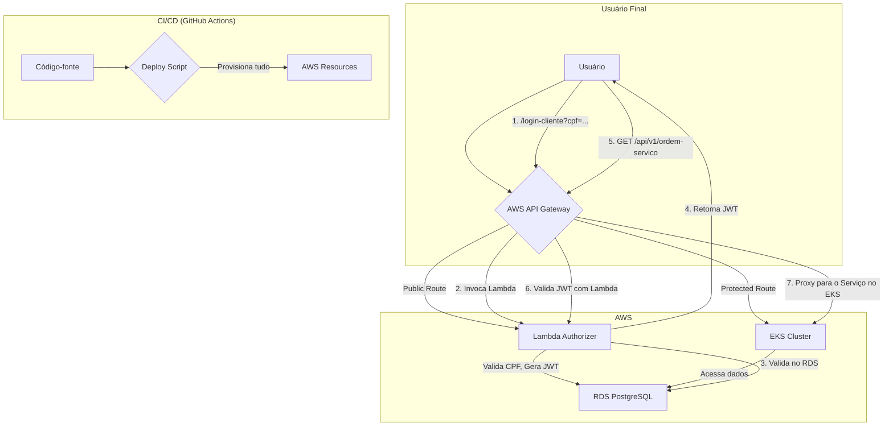

# MecanicaOS: Sistema de Gerenciamento para Oficinas - Tech Challenge

## 1. Visão Geral e Arquitetura

O **MecanicaOS** é uma solução completa para gerenciamento de oficinas mecânicas, implantada na AWS com automação total de infraestrutura e deployment. O projeto utiliza uma arquitetura moderna e escalável, projetada para atender aos requisitos de um ambiente de nuvem real.

### Arquitetura da Solução

O diagrama abaixo ilustra a arquitetura da solução na AWS:



- **AWS API Gateway (HTTP API):** Atua como o ponto de entrada para todas as requisições. Rotas públicas, como `/login-cliente`, são tratadas diretamente pela Lambda de autenticação. Rotas protegidas são validadas pela mesma Lambda e, se o JWT for válido, a requisição é encaminhada para o serviço rodando no EKS.
- **AWS Lambda Authorizer:** Uma única função Lambda que serve a dois propósitos:
    1.  **Autenticação:** Valida o CPF de um cliente no banco de dados RDS e gera um JWT.
    2.  **Autorização:** Valida o JWT enviado no cabeçalho `Authorization` para todas as requisições em rotas protegidas.
- **Amazon EKS (Kubernetes):** Orquestra os contêineres da aplicação. A API .NET roda em pods que são automaticamente escalados com base no uso de CPU (HPA).
- **Amazon RDS for PostgreSQL:** O banco de dados relacional, provisionado em subnets privadas para segurança. É acessado tanto pela Lambda quanto pelos pods no EKS.
- **AWS Secrets Manager:** Armazena com segurança as credenciais do RDS, que são dinamicamente injetadas na aplicação durante o deploy.
- **Amazon ECR:** O registro de contêineres onde a imagem Docker da aplicação é armazenada.

## 2. Automação Total (Um Comando para Dominar Todos)

O projeto foi desenhado para ser implantado com um único comando, sem qualquer intervenção manual.

### Pré-requisitos

-   [AWS CLI](https://aws.amazon.com/cli/) configurado com credenciais válidas.
-   [Terraform CLI](https://learn.hashicorp.com/tutorials/terraform/install-cli) instalado.
-   [kubectl](https://kubernetes.io/docs/tasks/tools/install-kubectl/) instalado.
-   [Docker Desktop](https://www.docker.com/products/docker-desktop/) em execução.
-   [Python](https://www.python.org/downloads/) e `pip` instalados.
-   [Git](https://git-scm.com/downloads) instalado.
-   **`GIT_TOKEN`:** Uma variável de ambiente chamada `GIT_TOKEN` deve ser configurada com um [Personal Access Token (PAT)](https://docs.github.com/en/authentication/keeping-your-account-and-data-secure/creating-a-personal-access-token) do GitHub. Este token é necessário para que o processo de build (Kaniko) possa clonar o repositório de forma segura.

### Como Subir a Solução

1.  **Clone o repositório:**
    ```bash
    git clone <URL_DO_REPOSITORIO>
    cd <NOME_DO_REPOSITORIO>/terraform
    ```

2.  **Execute o script de deploy:**
    ```powershell
    ./deploy-completo.ps1
    ```

O script irá automaticamente:
1.  **Provisionar a infraestrutura:** Criar a VPC, subnets, EKS, RDS, API Gateway, Lambda e todos os recursos necessários com o Terraform.
2.  **Construir e publicar a imagem:** Compilar a aplicação .NET, construir a imagem Docker e enviá-la para o ECR.
3.  **Implantar no Kubernetes:** Configurar o `kubectl`, criar um segredo com a connection string do RDS e aplicar os manifestos do Kubernetes para implantar a API.
4.  **Exibir as saídas:** Ao final, o script exibirá a URL pública da API Gateway, pronta para ser usada.

### Como Destruir a Solução

Para remover todos os recursos criados na AWS, execute:

```powershell
./deploy-completo.ps1 -Destroy
```

## 3. Fluxo de Autenticação

1.  **Login:** O cliente envia uma requisição `GET` para a rota pública `/login-cliente` na API Gateway, passando o CPF como um query parameter.
2.  **Validação do CPF:** A API Gateway invoca a Lambda, que se conecta ao RDS, verifica se o cliente com o CPF informado existe e está ativo.
3.  **Geração do JWT:** Se o cliente for válido, a Lambda gera um JWT com validade de 24 horas e o retorna para o cliente.
4.  **Requisições Autenticadas:** Para acessar qualquer outra rota da API, o cliente deve incluir o JWT no cabeçalho `Authorization: Bearer <TOKEN>`.
5.  **Validação do JWT:** A API Gateway utiliza a mesma Lambda como um autorizador. A Lambda valida a assinatura e a expiração do token. Se for válido, a requisição é liberada e encaminhada para o serviço correspondente no EKS.

## 4. Acesso à API

-   **URL Base:** A URL da API Gateway será exibida no final da execução do script de deploy.
-   **Swagger UI:** A documentação interativa da API está disponível em `<URL_BASE>/swagger`.
