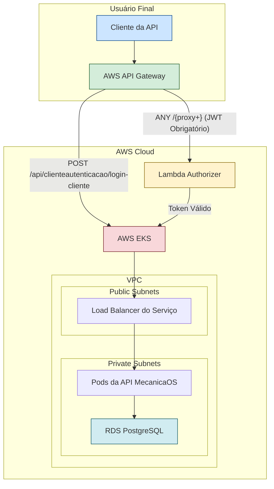

# MecanicaOS: Tech Challenge - Full Stack Deployment

## 1. Visão Geral

Este repositório contém a solução completa para o Tech Challenge, que consiste em uma API .NET para gerenciamento de oficinas (`MecanicaOS`), provisionada em uma infraestrutura AWS totalmente automatizada com Terraform e um pipeline de deploy de comando único.

O objetivo é demonstrar uma solução "production-ready" que vai do código à nuvem sem intervenção manual, cobrindo:
- **Infraestrutura como Código (IaC):** Usando Terraform para criar VPC, EKS, RDS e API Gateway.
- **Autenticação Segura:** Um fluxo de autenticação desacoplado com JWT, usando um Lambda Authorizer no API Gateway.
- **Banco de Dados Gerenciado:** RDS PostgreSQL em subnets privadas para segurança.
- **Orquestração de Contêineres:** API rodando em um cluster EKS.
- **Automação Total:** Um pipeline de CI/CD no GitHub Actions que orquestra todo o processo.

---

## 2. Arquitetura da Solução

O diagrama abaixo ilustra a arquitetura implantada na AWS:



### Fluxo de Autenticação

1.  **Login:** O cliente envia uma requisição `POST` para o endpoint público `/api/clienteautenticacao/login-cliente` no API Gateway, contendo o CPF.
2.  **Geração do JWT:** A API `MecanicaOS` (rodando no EKS) recebe a requisição, valida o CPF no banco de dados RDS e, se o cliente for válido, gera um JWT assinado com um segredo.
3.  **Retorno do Token:** A API retorna o JWT para o cliente.
4.  **Acesso a Rotas Protegidas:** Para acessar qualquer outro endpoint, o cliente deve incluir o JWT no header `Authorization: Bearer <token>`.
5.  **Validação do Token:** O API Gateway intercepta a requisição, invoca o **Lambda Authorizer**, que valida a assinatura e a expiração do JWT.
6.  **Acesso à API:** Se o token for válido, o Lambda Authorizer permite que a requisição prossiga para o backend no EKS. Caso contrário, o acesso é negado.

---

## 3. Como Executar o Deploy Completo

A solução é implantada automaticamente através de um pipeline de CI/CD no GitHub Actions.

### 3.1. Pré-requisitos

-   **Conta AWS:** Uma conta AWS com permissões para criar os recursos necessários (EKS, RDS, etc.).
-   **Segredos do GitHub:** O repositório no GitHub precisa ter os seguintes segredos configurados para que o pipeline possa se autenticar na AWS:
    -   `AWS_IAM_ROLE_TO_ASSUME`: O ARN do role do IAM que o GitHub Actions deve assumir para ter permissões de deploy.

### 3.2. Instruções

1.  **Faça um push para a branch `Main`:**
    ```bash
    git push origin Main
    ```
2.  **Acompanhe o pipeline:**
    -   Vá para a aba "Actions" no seu repositório do GitHub.
    -   O workflow "Deploy to AWS" será iniciado automaticamente.

O pipeline cuidará de tudo:
-   Fará o build da imagem Docker da API.
-   Fará o push da imagem para um novo repositório no Amazon ECR.
-   Instalará as dependências da função Lambda Authorizer.
-   Executará `terraform init` e `terraform apply` para provisionar toda a infraestrutura na AWS.
-   Ao final do log do job de deploy, você encontrará a URL do API Gateway para interagir com a API.

---

## 4. Tecnologias Utilizadas

| Categoria                | Tecnologia           |
| ------------------------ | -------------------- |
| **Backend**              | .NET 8.0, ASP.NET Core |
| **Banco de Dados**         | PostgreSQL (AWS RDS) |
| **Infraestrutura como Código** | Terraform            |
| **Orquestração**         | Kubernetes (AWS EKS) |
| **Containerização**      | Docker, Amazon ECR   |
| **Autenticação Serverless** | AWS Lambda, API Gateway |
| **CI/CD**                | PowerShell, AWS CLI  |
