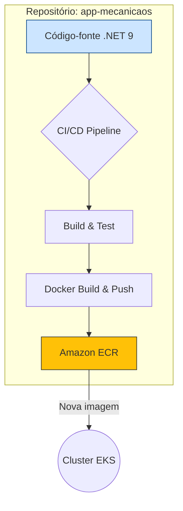

# Repositório: Aplicação Principal (MecanicaOS)

Este repositório contém o código-fonte da API principal da solução MecanicaOS, desenvolvida em .NET 9 com Clean Architecture.

## 1. Visão Geral

A API é responsável por toda a lógica de negócio do sistema, incluindo o gerenciamento de Ordens de Serviço, Clientes, Veículos e Estoque. Ela é projetada para ser executada como um contêiner dentro do cluster Kubernetes (EKS).

## 2. Arquitetura

A aplicação segue os princípios da **Clean Architecture**, dividida nas seguintes camadas:
- **Core:** Contém as entidades de domínio, casos de uso e regras de negócio.
- **Adapters:** Camada de adaptação e conversão entre as camadas.
- **Infraestrutura:** Implementações concretas de repositórios, acesso ao banco de dados (PostgreSQL com EF Core) e serviços externos.
- **API:** Ponto de entrada da aplicação, com os Controllers REST, configuração de middlewares e injeção de dependência.

## 3. Execução Local (Docker)

Para executar a aplicação em um ambiente de desenvolvimento local:

1.  **Pré-requisito:** Docker Desktop instalado.
2.  **Configurar segredos:** Configure as variáveis de ambiente necessárias, como a string de conexão do banco e o segredo JWT, em um arquivo `.env`.
3.  **Subir o contêiner:**
    ```bash
    docker build -t mecanicaos-api .
    docker run -p 8080:80 --env-file .env mecanicaos-api
    ```
4.  A API estará acessível em `http://localhost:8080`, e o Swagger em `http://localhost:8080/docs`.

## 4. Pipeline de CI/CD

O pipeline de CI/CD para este repositório está configurado com GitHub Actions e automatiza os seguintes passos:

1.  **Trigger:** Um push para a branch `main` ou a criação de um Pull Request.
2.  **Build & Test:** A aplicação é compilada e os testes unitários são executados.
3.  **Docker Build & Push:** Uma nova imagem Docker é construída, tagueada com o SHA do commit e enviada para o Amazon ECR (Elastic Container Registry).
4.  **Deploy (Trigger):** O pipeline notifica (via webhook ou outra ação) o repositório `infra-kubernetes` de que uma nova imagem está disponível, para que o deploy no EKS seja atualizado.

## 5. Diagrama do Componente


