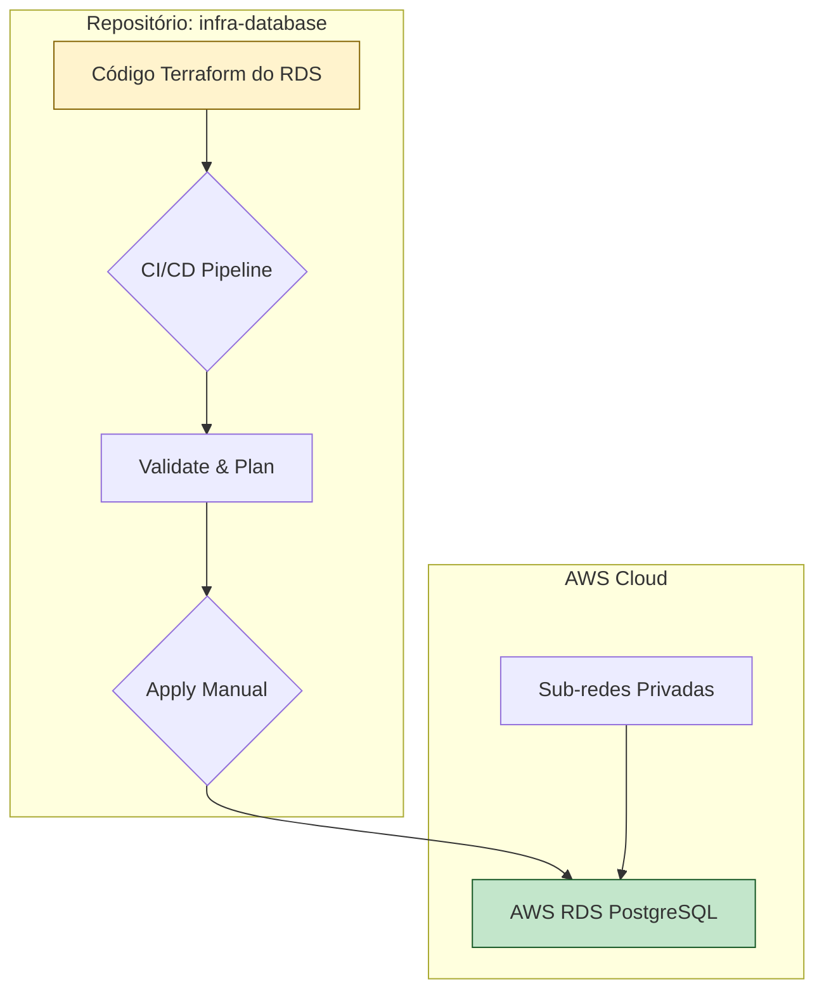

# Repositório: Infraestrutura do Banco de Dados

Este repositório contém o código Terraform para provisionar e gerenciar o banco de dados da solução MecanicaOS.

## 1. Visão Geral

O Terraform neste repositório é responsável por criar um banco de dados **AWS RDS (Relational Database Service)** com o engine **PostgreSQL**.

O objetivo é ter um banco de dados gerenciado, escalável e seguro, desacoplado do ciclo de vida da aplicação.

## 2. Recursos Provisionados

-   **`aws_db_instance`**: A instância principal do banco de dados, configurada para custo mínimo (ex: `db.t3.micro`), sem Multi-AZ.
-   **`aws_db_subnet_group`**: Garante que o RDS seja posicionado exclusivamente nas sub-redes privadas da VPC.
-   **`aws_security_group`**: Um Security Group dedicado para o RDS, que controla o tráfego de entrada e saída.

## 3. Execução (Provisionamento)

Para provisionar o banco de dados:

1.  **Pré-requisitos:**
    -   Terraform CLI instalado.
    -   Credenciais da AWS configuradas.
    -   A VPC principal e as sub-redes já devem existir.

2.  **Inicializar o Terraform:**
    ```bash
    terraform init
    ```

3.  **Planejar e Aplicar:**
    ```bash
    terraform plan -out=tfplan
    terraform apply "tfplan"
    ```

## 4. Pipeline de CI/CD

O pipeline para este repositório garante a aplicação segura das mudanças de infraestrutura:

1.  **Trigger:** Um push para a branch `main` ou a criação de um Pull Request.
2.  **Validate & Plan:** O Terraform é inicializado, formatado e validado. Um `terraform plan` é executado para prever as mudanças.
3.  **Apply (Manual):** A aplicação das mudanças (`terraform apply`) é um passo manual, geralmente após a aprovação de um Pull Request, para evitar alterações acidentais na infraestrutura crítica.

## 5. Diagrama do Componente


