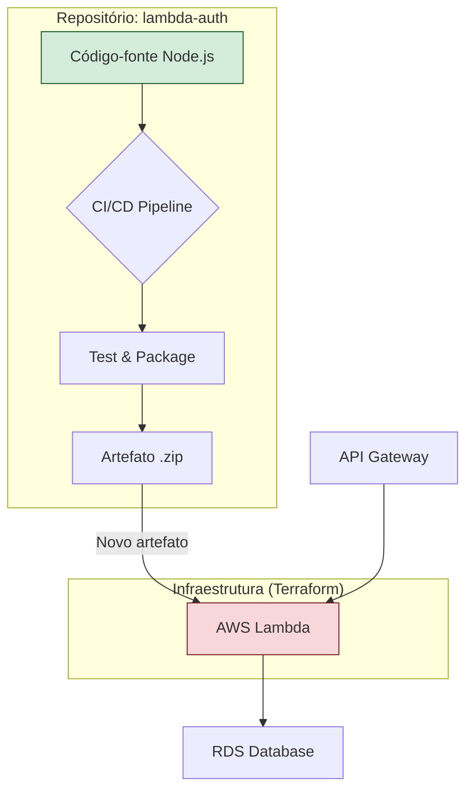

# Repositório: Lambda de Autenticação

Este repositório contém o código-fonte da função AWS Lambda responsável pela autenticação de clientes na solução MecanicaOS.

## 1. Visão Geral

A Lambda é desenvolvida em Node.js e tem uma única responsabilidade: receber um CPF, validar o cliente correspondente no banco de dados PostgreSQL e, se o cliente for válido e ativo, gerar um token JWT (JSON Web Token) com validade de 1 hora.

Ela é projetada para ser invocada exclusivamente pelo AWS API Gateway.

## 2. Lógica de Negócio

1.  Recebe um evento do API Gateway com um corpo JSON contendo o `cpf`.
2.  Conecta-se ao banco de dados RDS.
3.  Consulta a tabela `clientes` em busca do CPF fornecido.
4.  Verifica se o cliente existe e se seu status é "Ativo".
5.  Se a validação for bem-sucedida, gera um token JWT assinado com uma chave secreta.
6.  Retorna o token JWT ou uma mensagem de erro apropriada.

## 3. Teste Local

Para testar a função localmente:

1.  **Pré-requisitos:** Node.js e `npm` instalados.
2.  **Instalar dependências:**
    ```bash
    npm install
    ```
3.  **Configurar variáveis de ambiente:** Crie um arquivo `.env` com as variáveis de conexão do banco (`DB_HOST`, `DB_USER`, etc.) e o `JWT_SECRET`.
4.  **Executar:** Use uma ferramenta como `sam local invoke` (do AWS SAM CLI) ou um script Node.js para simular um evento do API Gateway e invocar a função.

## 4. Pipeline de CI/CD

O pipeline de CI/CD para este repositório automatiza o deploy da Lambda:

1.  **Trigger:** Um push para a branch `main`.
2.  **Test:** Execução de testes unitários (se aplicável).
3.  **Package:** O código e suas dependências são empacotados em um arquivo `.zip`.
4.  **Deploy:** O repositório `infra-kubernetes` (que gerencia a infraestrutura principal) é notificado, e o Terraform aplica a nova versão da Lambda a partir do artefato `.zip` gerado.

## 5. Diagrama do Componente


